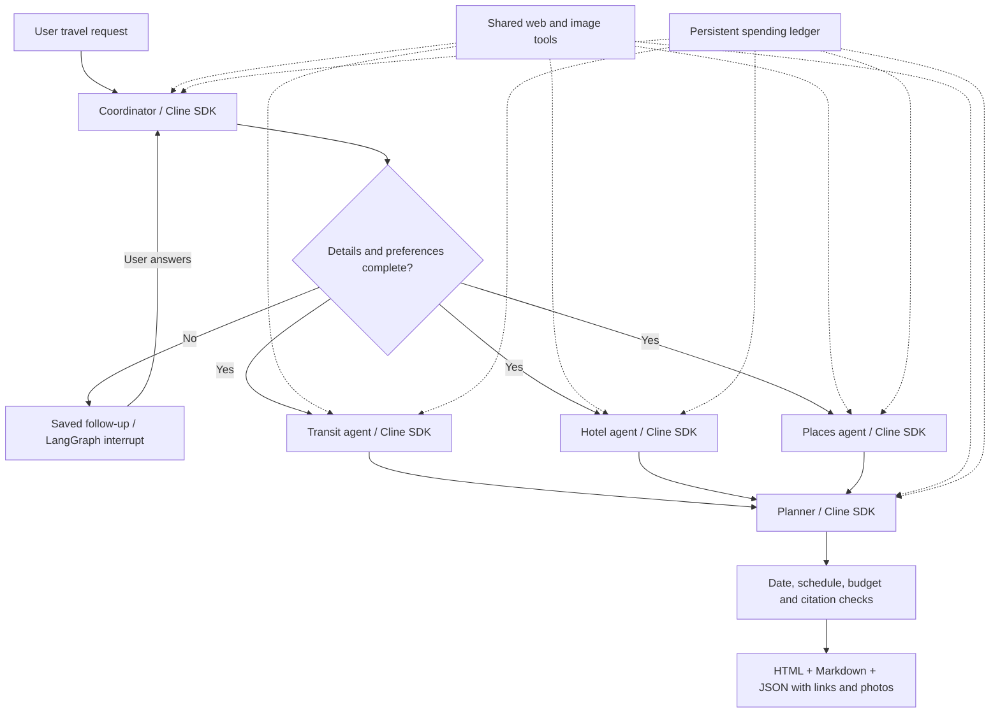

# OptiRoute

A simplified version of the multi-agent travel planner in `Screenshot 2026-10-04 112700.png`. Real Cline SDK agents ask follow-up questions, run three parallel research branches, and return an itinerary with links, images, budget estimates, and validation results.

## Run It

The Python virtual environment and Node dependencies are already installed in this workspace. The supplied OpenRouter key is stored only in the ignored `.env` file. Do not put keys in prompts or commit that file.

```powershell
# Interactive trip planning; the agent asks for missing details and preferences.
.\.venv\Scripts\python.exe -m optiroute chat "Plan a relaxed weekend in Jaipur from Delhi"

# Completely unbilled demo using the real Cline SDK loop and simulated model responses.
.\.venv\Scripts\python.exe -m optiroute demo

# Inspect the current cheapest tool-capable models; no generation charges.
.\.venv\Scripts\python.exe -m optiroute models

# Inspect key validity, dependencies, and the local spending ledger.
.\.venv\Scripts\python.exe -m optiroute doctor

# Local chat interface and REST API.
.\.venv\Scripts\python.exe -m uvicorn optiroute.api:app --host 127.0.0.1 --port 8000
```

Open **http://127.0.0.1:8000** for the chat interface. Choose Cline, OpenRouter, or the unbilled Jaipur demo in the provider selector, enter a trip request, and answer the coordinator's questions in the same chat. Cline is selected by default when its key is configured. After clarification, three clickable specialist panels appear. Each streams its public draft and opens an Activity/Output drawer with timestamped searches, retrieved sources, validation feedback, and the published research. The planner then delivers photos, a day-by-day itinerary, transport, stays, a budget, citations, checks, and report downloads inside the conversation.

Agent panels show observable work and public draft output, **not private chain-of-thought**. Provider reasoning fields and credentials are stripped before persistence or delivery. All configured agents still have web and image tools; quotas and spending checks are unchanged. The Python transport requests actual provider SSE chunks, forwards public output to the browser, and assembles the response for the existing Cline SDK tool loop. It does not make extra model calls just to display progress. Demo mode uses explicitly labeled fixture output, not real model streaming or live facts.

Chat history, follow-up state, and the public event log are saved in SQLite. Browser disconnects do not cancel jobs. Reloads restore the conversation and replay activity; SSE reconnects use event IDs to avoid duplicate display or model requests. The stop button cancels the graph task and terminates active Cline workers. Ambiguous provider billing reservations remain in the ledger. A server restart preserves completed trips and waiting follow-ups; interrupted active requests are marked failed instead of silently retried. Older saved trips are imported into the history.

Swagger is still at `http://127.0.0.1:8000/docs`. The original synchronous endpoints are compatible: `POST /runs` takes `{"message":"your travel request"}`; send follow-up answers to `POST /runs/{run_id}/answers`. `GET /runs/{run_id}` retrieves checkpoints; `GET /spending` shows accounted spending. The browser uses disconnect-safe asynchronous endpoints: `POST /chats` with `message` and `mode`, `POST /chats/{run_id}/answers`, `GET /chats/{run_id}/events`, and `POST /chats/{run_id}/cancel`. `GET /chats` lists saved conversations. `GET /runs/{run_id}/download/{html|md|json}` downloads reports.

The legacy endpoints wait for the current stage; chat endpoints return immediately and stream progress. Planning may take several minutes on free models. The app binds to localhost, rejects cross-origin mutations, and is intended for local development, not public exposure.

Rebuild UI and worker changes with `npm.cmd run build`. For frontend development, `npm.cmd run dev:ui` starts Vite on port 5173 and proxies to the API on 8000. Normal use needs only the FastAPI server, which serves the production frontend build.

### Use a Cline API Key

The supplied Cline key is saved in the ignored `.env` as `CLINE_API_KEY`. Select Cline per invocation:

```powershell
.\.venv\Scripts\python.exe -m optiroute chat "Plan a trip to Switzerland" --provider cline
.\.venv\Scripts\python.exe -m optiroute models --provider cline
.\.venv\Scripts\python.exe -m optiroute doctor --provider cline
.\.venv\Scripts\python.exe -m optiroute repair <run_id> --provider cline

# Automated live test with declared sample assumptions and a $0.02 run cap.
.\.venv\Scripts\python.exe scripts/switzerland_smoke.py
```

Set `MODEL_PROVIDER=cline` in `.env` to select Cline for both the CLI and the API by default, then restart the API. `CLINE_MODEL` and `CLINE_PLANNER_MODEL` select the role models. Cline's public detailed catalog supplies tool capabilities and pricing; the current configured model is `inclusionai/ling-3.1-flash`, which was zero-priced during the test. Product-only `cline-free/*` aliases are excluded from that public catalog. Paid models require `--paid` and pass the same spending checks. The Cline adapter unwraps its `success`/`data` response before validating output and accounting for reported usage. Credentials remain in the Python host.

For Cline, `doctor` reports whether a key is configured; authentication is verified by an actual completion request. It does not claim to check account credit. The original OpenRouter configuration is also available with `--provider openrouter`.

Every completed plan is exported into `outputs/<run_id>/plan.html`, `plan.md`, and `plan.json`. The HTML report includes photos, source links and a printable layout. Use the browser's Print to PDF for a PDF copy. Images are retrieved from the web, not generated; internet access is required to display them.

For a fresh installation:

```powershell
python -m venv .venv
.\.venv\Scripts\python.exe -m pip install -r requirements.lock.txt
npm.cmd ci
npm.cmd run build
```

Python 3.14 and Node.js 22.20 were used here. Node.js 22+ is required by the pinned Cline SDK. `.env.example` documents all settings. A new installation without `.env` needs `OPENROUTER_API_KEY` configured for live runs.

## Workflow



The original image adds asynchronous delay updates, a shared task board, a compiler, routing optimization, strict validation, targeted repairs, global replanning, user review, PDF export and a 3D map. This first version combines the compiler and planner, uses graph state as the shared task board, and includes basic deterministic validation with bounded planner corrections. Live routing optimization, provider-backed booking validation, event-driven replanning and the 3D map are future stages.

## Framework Choices

- **Cline SDK 0.0.90 / TypeScript:** actual agent reasoning and tool-execution loops, including a structured completion tool. Every agent has `search_web` and `search_images`. Agents receive only these tools and `submit_result`; they do not have shell or filesystem tools.
- **LangGraph / Python:** workflow transitions, genuine parallel fan-out/fan-in, human input interrupts and SQLite checkpoints.
- **FastAPI + Pydantic:** local API, typed inputs and schema-validated research and plans.
- **HTTPX:** OpenRouter and Cline API calls through a shared, budget-aware transport. The SDK uses its supported custom `AgentModel` interface; this allows each request to be checked before it reaches the selected provider.
- **DDGS + Wikimedia:** free web search and destination photos, with a six-hour SQLite cache. Wikipedia reference results are an explicitly labeled fallback when general search fails. Commons is preferred for licensed images; image-search fallback has source attribution and unverified reuse rights clearly marked. Photo URLs are checked for successful image responses and policies that allow embedding; unavailable or restricted photos are omitted.
- **React + Vite + Lucide:** responsive chat workspace, incremental drafts, replayable SSE, source-linked agent activity, and inline travel reports. No additional model-provider framework is needed.
- **Jinja2:** escaped, printable HTML exports of the same plans.

The Python host and Node worker communicate through JSON messages on standard input/output. API credentials stay in the Python host and are never included in agent prompts or transmitted to the Node worker. Standard automatic tool selection supports providers that reject forced tool selection; Cline's completion policy still requires a validated `submit_result`. SDK types are imported from `@cline/shared`; its published declarations need TypeScript's Bundler resolution mode with this release.

## Cost Controls

The default coordinator, specialists and planner use `qwen/qwen3.8-27b:free`, which appeared in the live tool-capable catalog on October 4, 2026. Optional reasoning is disabled for these simple stages to preserve the structured-output allowance. Free models can be rate-limited or unavailable. There is no automatic fallback to a paid model.

| Model | Input / 1M tokens | Output / 1M tokens | Use |
| --- | ---: | ---: | --- |
| `qwen/qwen3.8-27b:free` | $0 | $0 | Default free test model |
| `openrouter/free` | $0 | $0 | Alternative free router; model may change |
| `mistralai/mistral-nemo` | $0.019 | $0.030 | Cheapest paid tool-capable model in the checked catalog |
| `qwen/qwen3.7-flash` | $0.030 | $0.130 | Low-cost paid candidate for agent workflows |

These are catalog prices checked on October 4, 2026, not guaranteed future prices. `models` refreshes the catalog; availability and tool behavior still need testing. Automatic/variable-price routers and batch-only entries are excluded from cheap-model selection.

To explicitly test a paid model:

```powershell
.\.venv\Scripts\python.exe -m optiroute chat "Your trip request" --model qwen/qwen3.7-flash --paid
```

Defaults are **$0.03 maximum per trip** and **$0.25 total for this project's ledger**, leaving most of the stated $3 allowance unused. Each agent invocation is limited to three model calls and two executed web searches. A follow-up starts a new coordinator invocation; explicit repair starts a new planner invocation. Prompt context and output lengths are bounded. Provider routing is sorted by price and capped at the checked catalog's input/output/request prices.

Before a call, the host reserves a conservative upper-bound cost in a transactional SQLite ledger. Parallel agents cannot individually bypass the shared limits. On success it records reported billing; on ambiguous errors it retains the reservation. Explicit non-billable request failures release it. Reservations survive restarts. The ledger does not track spending from Cline, OpenRouter's website or other applications, so an account-side API-key limit is the stronger project-wide control. Key metadata limits are not the account's prepaid balance.

Demo mode uses a separate checkpoint database and spending ledger. It exercises the Cline SDK but sends no requests to OpenRouter or search providers.

## Resume and Verify

Blank answers in the interactive CLI save the run for later. Restart and resume with:

```powershell
.\.venv\Scripts\python.exe -m optiroute resume <run_id>
.\.venv\Scripts\python.exe -m optiroute status <run_id>
.\.venv\Scripts\python.exe -m optiroute repair <run_id>

# Retry only the planner with an explicitly selected low-cost paid model.
.\.venv\Scripts\python.exe -m optiroute repair <run_id> --model qwen/qwen3.7-flash --paid
```

Resume is supported when waiting for follow-up answers. The graph stores the coordinator output before interrupting, so restoring that interrupt does not repeat its model request. A failed research branch is exposed to the planner as missing research. If all source retrieval fails, the pipeline stops instead of inventing an itinerary. Malformed outputs and planner constraint errors are fed back for correction within the same three-call limit. The final draft is explicitly marked for review if constraints remain unresolved. `repair` reuses saved specialist research and invokes only the planner; it remains subject to the same spending caps.

```powershell
npm.cmd run typecheck
.\.venv\Scripts\python.exe -m pytest
.\.venv\Scripts\python.exe scripts/smoke.py
node scripts/check_chat.mjs
# Optional live Cline chat test, using free models and declared Switzerland assumptions.
node scripts/check_chat.mjs --live
```

The CLI smoke test is live, free by default and capped at $0.02 per run. `--model <id> --paid` permits a specific paid test. `check_chat.mjs` uses offline Jaipur fixtures by default and requires the local API on port 8000 (override with `CHAT_URL`). It uses installed Chrome and saves desktop/mobile screenshots under `data/chat-qa`. `--live` instead tests the entire browser flow with Cline and Switzerland, asserting zero accounted spend. Unit/integration coverage includes streaming tool arguments, discarded reasoning, truncated streams, usage accounting, event replay, duplicate follow-ups, cancellation, recovery, exports, and local-origin protection.

### Verified in This Workspace

On October 4, 2026, TypeScript type checking and all 24 tests passed. Tests exercise the real Cline worker for structured completion and bounded correction, and LangGraph for durable follow-up and concurrent research. The live Jaipur run `b135346a-08b4-4c2a-9fe1-c164b5bf7e1e` completed with 19 sources, three photos and $0 accounted API spend. Its saved research was reused for a planner repair with `openrouter/free`. The repaired estimate is INR 12,100 against an INR 14,000 budget; it remains `needs_review` because both days contain five activities despite the requested relaxed pace. Prices and availability still need confirmation.

The final HTML report passed headless browser checks at 1280px and 390px widths: all images loaded, no horizontal overflow and no page errors. The local API health and report endpoints returned successfully. A paid planner test was rejected for insufficient available credit; the key's metadata limit does not establish its usable account balance. No automatic paid fallback was enabled.

A subsequent live Switzerland test used the supplied Cline key with `inclusionai/ling-3.1-flash`. Run `7fb54b5c-dc65-437d-9e7f-ca786e657b9f` completed clarification, all three parallel specialist branches and the planner. It covers June 7-13, 2027, from Delhi for two adults, with a CHF 6,000 group budget. Those are explicitly labeled test assumptions. The final report has 20 sources and two photos that passed desktop/mobile browser checks. One site-restricted image was omitted. The estimated total is CHF 4,420; there are no basic validation errors, but uncited budget estimates keep the report at `needs_review`. Cline reported $0 billing for all calls in the successful run, with no outstanding reservations. All 31 tests pass after adding provider-response, billing and photo-availability coverage.

### Chat Interface Verification

The chat extension passes all **42 automated tests**, TypeScript type checking, and the frontend build. The offline browser test verifies follow-ups, three concurrent agent panels, incremental draft output, activity/source drawers, itinerary day selection, report tabs, history restoration, mobile navigation, and the stop button. Screenshots are in `data/chat-qa/demo`.

Live Cline chat `a414d7bf-bb73-4e71-959c-76295a2116f7` completed all three streamed specialists and the planner using the free `inclusionai/ling-3.1-flash` model. The seven-day Switzerland report contains **25 sources and two images**. Cline reported **$0** for the run. The declared sample assumptions are Delhi, June 7-13, 2027, two adults, and CHF 6,000 for the group; these are test inputs, not confirmed user preferences. The known estimate is CHF 4,290, with basic date, budget, schedule, and citation-ID checks passing. Search excerpts are still not verified booking quotes.

Open `http://127.0.0.1:8000/?chat=a414d7bf-bb73-4e71-959c-76295a2116f7` to inspect the complete conversation. The saved-run browser test confirms no report flicker during long activity replay, all agent drawers, all report sections, loaded images, zero page errors, and no horizontal overflow at 1440px and 390px. It reuses the saved run without calling a model:

```powershell
node scripts/check_chat.mjs --live --run=a414d7bf-bb73-4e71-959c-76295a2116f7
```

Tool schemas are dereferenced before provider requests. Schema-aware normalization decodes JSON-encoded object/array parameters without altering ordinary strings or relaxing validation. Explicit concise-output instructions keep the final structured submission within field limits, preserving the existing three-call cap rather than adding retries. Historical state events cannot overwrite a newer chat snapshot during replay.

`npm audit` currently reports 32 dependency vulnerabilities, including 14 high-severity findings. This local application should not be exposed publicly until the dependency tree and deployment controls are hardened. API keys remain server-side in the ignored `.env`; rotate keys shared in chat before deployment.

## Practical Limits

This is a working prototype with production-oriented foundations, not a booking engine. The validator checks date coverage, ordering and overlaps, budget category coverage and totals, and whether citations came from the tools. It does not prove that a source supports every model claim, verify current room/seat inventory, determine flight/train timings, calculate geographic travel durations or validate actual opening hours. Unknown costs, uncited budget estimates and unresolved relaxed-pace violations force `needs_review`. Trips are limited to 14 days.

The chat jobs use an in-process task manager with durable checkpoints and activity, not a distributed job queue. Use one API worker. Before public deployment, add authentication and ownership of runs, a durable external job queue, request rate limits, audited provider integrations for prices and availability, geographic routing, and semantic evidence checks. The pinned pre-release Cline SDK dependency tree also needs a dependency-security review before deployment. For the full architecture, next add bounded targeted repair using structured validator errors, then delay-event replanning and interactive maps. Provider failures never justify silently increasing model spend.

## References

- [Cline SDK concepts](https://docs.cline.bot/sdk/clinecore)
- [Cline SDK custom tools](https://docs.cline.bot/sdk/guides/creating-custom-tools)
- [Cline API examples](https://docs.cline.bot/api/sdk-examples)
- [Cline chat completions and streaming](https://docs.cline.bot/api/chat-completions)
- [LangGraph interrupts and checkpointing](https://docs.langchain.com/oss/python/langgraph/interrupts)
- [OpenRouter model catalog](https://openrouter.ai/api/v1/models)
- [OpenRouter provider price caps](https://openrouter.ai/docs/guides/routing/provider-selection)
- [OpenRouter free model variants](https://openrouter.ai/docs/guides/routing/model-variants/free)

