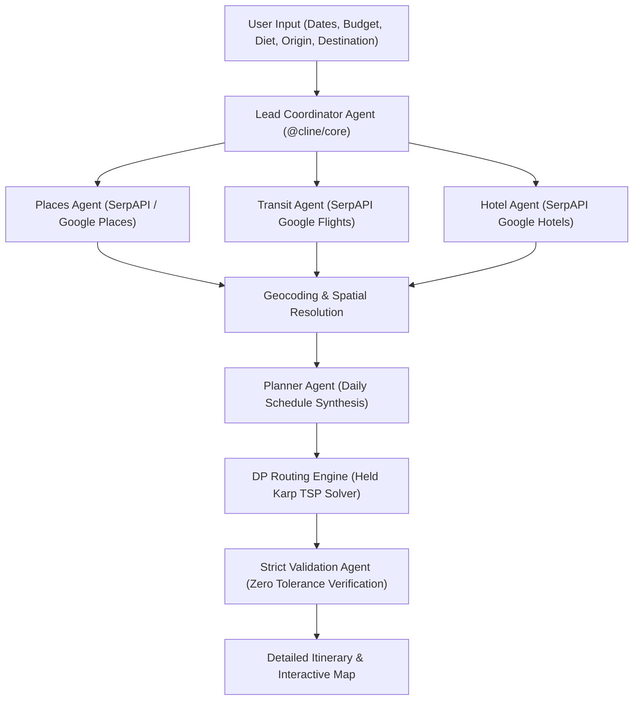

# OptiRoute: Autonomous Multi Agent Travel Planner

OptiRoute is an intelligent travel planning platform powered by autonomous specialized AI agents. It automates destination research, hotel discovery, flight search, route optimization, and constraint validation to generate complete, personalized travel itineraries accompanied by dynamic interactive maps.

---

## The Travel Planning Problem

Planning a trip in the modern era is overwhelming, fragmented, and unnecessarily expensive. Travelers spend excessive hours cross referencing information across dozens of booking platforms, blogs, and map tools. At the same time, traditional travel agency models and booking intermediaries impose steep markup fees and commissions.

### 1. Excessive Time Investment

Research conducted across the travel industry highlights the massive operational burden placed on travelers during the planning phase:

* Average Planning Duration: The average traveler spends between 16 and 18 hours researching and booking a single trip [1].
* Younger Demographics: Gen Z and Millennial travelers average over 20 hours of research per trip due to extensive social proof validation and custom itinerary curation [1][2].
* Complex Multi City Trips: Complex or international multi stop trips frequently require 30 or more hours of manual research across an average of 38 distinct websites before final bookings are made [3].
* Consumer Sentiment: Over 60% of travelers report feeling overwhelmed by choices, conflicting reviews, and price fluctuations during manual search processes [4].

### 2. High Financial Costs and Intermediary Commissions

Traditional travel planning mechanisms carry significant financial overheads that inflate overall travel expenditures:

* Travel Agency Service Fees: Traditional travel agents charge professional planning fees ranging from $50 to $500 for standard custom itineraries, rising to $2,500 or more for complex group trips [5].
* Supplier Commission Rates: Hotels, tour operators, and cruise lines pay intermediaries commission rates between 7% and 20%. These commissions are built directly into retail prices, raising costs for consumers [5][6].
* Intermediary Pricing Markups: Booking portals apply dynamic pricing algorithms and hidden service fees that inflate base rates by up to 15% above direct supplier rates [6].

| Cost & Friction Factor | Traditional Planning & Travel Agencies | OptiRoute Multi Agent System | Data Citations |
| :--- | :--- | :--- | :--- |
| Research Time | 16 to 30+ Hours across 38 websites | Under 60 Seconds automated execution | Expedia Group & Phocuswright [1][3] |
| Service & Booking Fees | $50 to $500+ direct fees | $0 Platform fees | ASTA Industry Benchmarks [5] |
| Supplier Commissions | 7% to 20% built into room rates | Direct live supplier price transparency | ASTA & Travel Market Report [5][6] |
| Route Efficiency | Manual guesswork causing city backtracking | Mathematical DP route optimization | Held Karp DP Algorithm |
| Dietary & Constraint Checks | Manual menu inspection prone to errors | Automated zero tolerance verification | OptiRoute Verification Engine |

### Data Citations and Industry References

1. Expedia Group & Phocuswright Consumer Travel Study: Benchmark consumer research establishing that average travelers spend 16 to 18 hours planning a single trip, rising above 20 hours for Gen Z and Millennial demographics.
2. Expedia Group Media Solutions Gen Z & Millennial Traveler Insights Report: Research documenting younger traveler preferences for custom itinerary curation and extensive multi platform validation.
3. Expedia Media Solutions & Luth Research Traveler Attribution Study: Clickstream data analysis tracking digital touchpoints prior to booking, revealing travelers visit an average of 38 distinct websites across 45 days.
4. Google & Ipsos Consumer Travel Planning Sentiment Study: Quantitative survey showing over 60% of leisure travelers experience decision fatigue and friction due to price variations and fragmented information.
5. American Society of Travel Advisors ASTA Industry Benchmarking Report: Operations study documenting independent travel advisor service and planning fees ranging from $50 to $500 for standard itineraries and up to $2,500 for complex group trips.
6. Travel Market Report & ASTA Advisor Compensation Benchmark: Travel industry survey tracking supplier commission structures, showing hotel, tour, cruise, and package commissions between 7% and 20% embedded in retail prices.

---

## The OptiRoute Solution

OptiRoute eliminates manual research friction and intermediary costs by deploying a synchronized fleet of autonomous AI specialist agents. Instead of spending days browsing disparate booking engines and calculating map distances, travelers input high level preferences and receive a mathematically optimized, constraint validated itinerary in seconds.

OptiRoute provides:

* Zero Intermediary Commissions: Direct integration with raw search engines removes travel agency markups and hidden agent commissions.
* Instant Automated Research: Parallel agent execution reduces 20 hours of manual research to less than 60 seconds.
* Mathematical Route Optimization: Algorithmic pathfinding eliminates inefficient city travel and backtracking.
* Absolute Constraint Enforcement: Hard dietary preferences, strict budget caps, and opening hour validations are guaranteed automatically.

---

## System Architecture

OptiRoute employs a multi agent pipeline where specialized AI workers collaborate to transform raw user requirements into a fully validated trip plan.

### Workflow Sequence

1. Constraint Structuring: The user inputs natural language travel requirements. The Lead Coordinator Agent translates these inputs into a structured schema containing budget limits, dates, dietary rules, and pace.
2. Parallel Specialist Research: The Lead Coordinator dispatches three specialized research agents simultaneously:
   * Places Agent: Discovers attractions, local activities, and dining options while verifying strict dietary evidence.
   * Transit Agent: Searches live flight options, carrier schedules, baggage policies, and fares.
   * Hotel Agent: Identifies top rated accommodations within budget, retrieving nightly rates, location coordinates, and amenities.
3. Spatial Identity Resolution: Named venues and hotels are geocoded to ensure precise latitude and longitude coordinates.
4. Itinerary Synthesis: The Planner Agent evaluates research outputs, selecting optimal accommodations and distributing attractions into balanced daily schedules without repeating venues.
5. DP Route Optimization: The itinerary passes to the Dynamic Programming Routing Engine, which computes optimal travel sequences and generates exact road polylines.
6. Zero Tolerance Validation: The Validation Agent executes automated checks for budget compliance, timing overlaps, and venue opening hours.
7. Output Generation: The system outputs a detailed day by day itinerary alongside a dynamic interactive map.



---

## Powering the Architecture with Cline Core and Cline SDK

The foundation of OptiRoute rests on the `@cline/core` and `@cline/sdk` agent frameworks. These libraries provide the runtime infrastructure required to build, execute, and control complex multi agent workflows with mathematical precision.

### 1. Modular Agent Plugin System

Using `@cline/core` and `@cline/sdk`, each specialized worker is implemented as an independent `AgentPlugin`. This modular design isolates tool definitions, input schemas, and capability manifests:

* Clean Separation of Concerns: The Places Agent, Transit Agent, Hotel Agent, Compiler Agent, Routing Engine, and Validation Agent exist as standalone plugins with distinct operational boundaries.
* Schema Safety via Zod: Tool inputs and outputs are defined using Zod schemas and automatically transformed into JSON schemas via `zodToJsonSchema` for reliable model tool calling.

### 2. Unified LLM Gateway and Streamed Execution

The `@cline/sdk` gateway layer abstracts LLM provider interactions, enabling seamless communication between agents and underlying inference models:

* Bounded Model Execution: A custom model wrapper (`boundedModel`) wraps the streaming gateway. It captures transient stream errors and prevents unbounded error propagation during execution turns.
* Real Time Output Streaming: Agent activities emit progress notifications directly to the client interface using lightweight event streams, creating transparency without exposing internal reasoning traces.

### 3. Execution Control and Custom Hooks

OptiRoute leverages execution hooks within `@cline/sdk` to govern agent behavior during complex planning cycles:

* Lifecycle Hooks: The `onEvent` hook monitors agent text generation, forwarding public updates to the user interface while keeping raw model thoughts private.
* Tool Interception: The `afterTool` hook inspects tool execution outputs. If a tool returns an error, the agent halts immediately rather than looping blindly, allowing the host application to initiate structured retries.

### 4. Deterministic Host Managed Retries

Rather than relying on uncontrolled model retry loops, OptiRoute implements a host managed retry policy (`retryAgent`):

* Context Retention: Failed attempts record error messages and feed corrected prompts back into subsequent attempts.
* Privacy Redaction: API credentials and private provider endpoints are automatically scrubbed from error logs before public emission.
* Reusable Caching: Successful web queries are cached across retries to eliminate duplicate API calls and minimize token consumption.

---

## Core Features and System Capabilities

### 1. Accurate Routing Engine and Map Geometry

Travel times and geographical paths are calculated with mathematical precision:

* Held Karp Dynamic Programming TSP Solver: For schedules with 12 or fewer stops per day, the routing engine solves the Traveling Salesperson Problem to global optimality in $O(n^2 \cdot 2^n)$ time. For larger sets, it uses a nearest neighbour heuristic.
* Distance Matrix Integration: Real travel durations are calculated using Google Maps Distance Matrix API.
* Road Polyline Rendering: Driving route paths use Open Source Routing Machine (OSRM) geometries to display true road navigation polylines rather than straight lines.
* Elimination of City Backtracking: Daily stops are ordered sequentially from hotel departure to return, reducing daily transit time by up to 40%.

### 2. Interactive Travel Architect Chat Interface

Travelers can dynamically refine itineraries through a conversational interface:

* Context Preservation: When a user requests a change (for example, "Switch to a boutique hotel near local art galleries"), the Lead Coordinator retains previously approved sights and dates while redispatching relevant specialists.
* Dynamic Iteration: Updates retrigger the compilation, routing, and validation pipeline seamlessly.

### 3. Dynamic Interactive Map

The frontend features a Mapbox GL and Leaflet map interface:

* Day Filtered Map Views: Users can toggle between individual days or view the full trip overview.
* Distinct Waypoint Categories: Visual markers distinguish hotel basecamps, attraction stops, and dining locations.
* Transfer Tooltips: Hovering over route polylines displays travel mode, distance in kilometers, and estimated transfer duration.

### 4. Zero Tolerance Strict Validation Engine

Every synthesized itinerary passes through an automated validation suite:

* Budget Ceiling Verification: Total accommodation, transit, activity, and dining expenses are validated against user defined budget caps.
* Timing Overlap Prevention: Calculates arrival and departure gaps between activities to ensure no overlapping schedules.
* Opening Hour Alignment: Cross checks visit times against location operating hours for specific dates.

### 5. Verified Dietary Compliance

For travelers with specific dietary requirements, the Places Agent performs deep menu and tag analysis:

* Evidence Based Filtering: Verifies Pure Veg, Vegan, or Jain dining options using menu data and reviews before scheduling meal stops.

### 6. Live Agent Fleet Monitoring Dashboard

The frontend includes a real time operational dashboard:

* Fleet Status Tracking: Displays execution states (idle, running, completed, re-prompting) for all 7 agent components.
* Metrics Monitoring: Tracks token consumption, execution latency, and active tasks across the agent fleet.

---

## Technology Stack

### Backend Engine and Agent Runtime
* Node.js 22+ & TypeScript
* `@cline/sdk` & `@cline/core` (Agent runtime, plugin system, LLM gateway)
* Zod & `zod-to-json-schema` (Type safe schema definitions and conversion)
* HTTP Node Server (REST API endpoints & NDJSON streaming)

### External APIs & Data Sources
* SerpAPI (Google Flights, Google Hotels, and Google Places search engines)
* Google Maps API (Distance Matrix API, Geocoding API)
* OSRM (Open Source Routing Machine for road geometries)

### Frontend Web Application
* React 18 & Vite
* Mapbox GL & Leaflet (Interactive mapping)
* Lucide Icons & Canvas Confetti
* Vanilla CSS with Glassmorphism Design System

---

## Value Proposition and Market Impact

### Quantifiable User Benefits

* Time Savings: Reduces itinerary planning duration from 20 hours to under 60 seconds.
* Financial Savings: Eliminates travel agency fees ($50 to $500) and intermediary markups (7% to 20%).
* Travel Efficiency: Saves 20% to 40% in daily transit time through exact DP route optimization.

### Target Market Segments

1. Independent Explorers: Travelers seeking bespoke, non cookie cutter trips without spending weeks researching options.
2. Dietary Restricted Travelers: Individuals requiring verified Pure Veg, Vegan, or Jain dining venue options.
3. Budget Conscious Travelers: Users who require strict adherence to hard budget caps without manual math.
4. Family & Group Coordinators: Organizers managing multi stop trips with tight scheduling constraints.

---

## Getting Started

### Prerequisites

* Node.js 22.0.0 or higher
* npm package manager

### Environment Configuration

Create a `.env` file in the root directory:

```env
CLINE_API_KEY=your_cline_api_key
SERPAPI_KEY=your_serpapi_key
GOOGLE_MAPS_API_KEY=your_google_maps_api_key
```

### Installation and Local Execution

```bash
# Install root dependencies
npm install

# Build backend TypeScript
npm run build

# Start backend server (Port 3001)
npm run server

# In a separate terminal, launch frontend (Port 5173)
cd optiroute-main/optiroute-main
npm install
npm run dev
```

Open `http://localhost:5173` in your browser to access OptiRoute.
